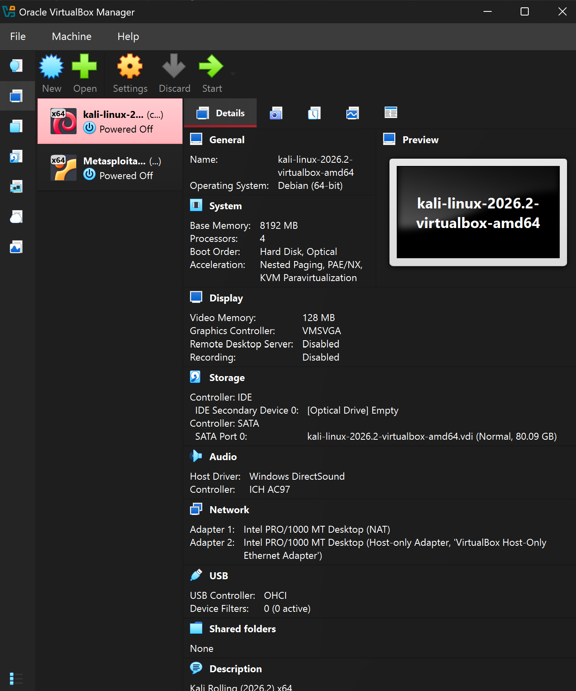
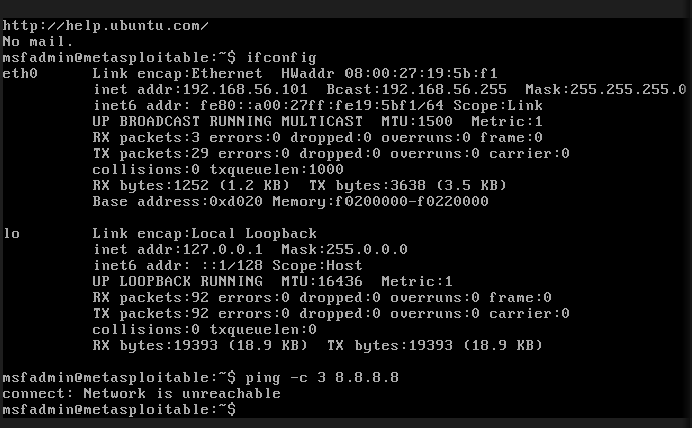
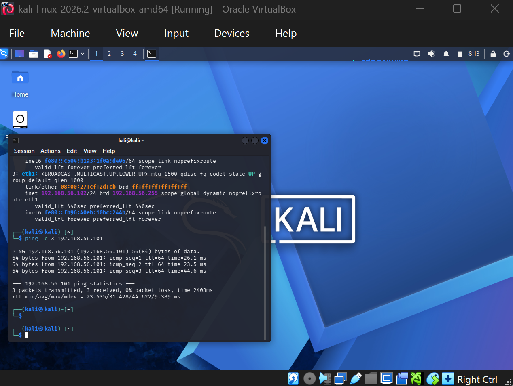
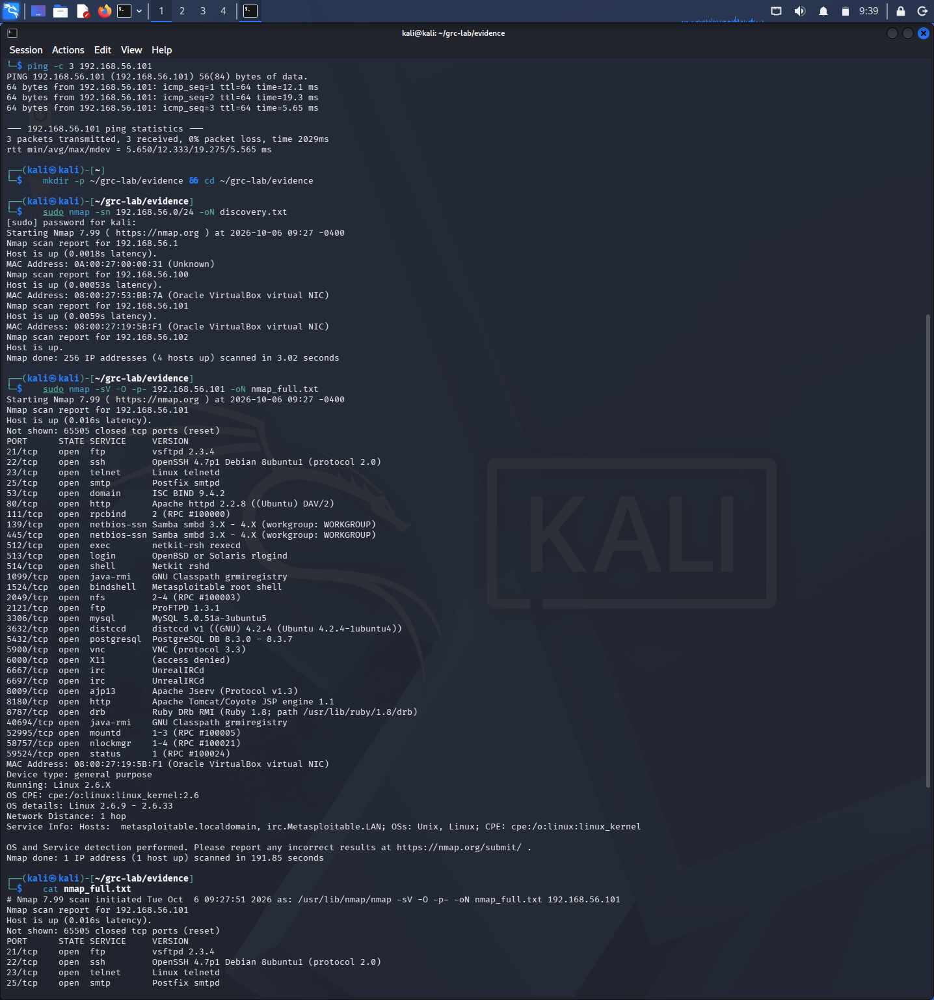
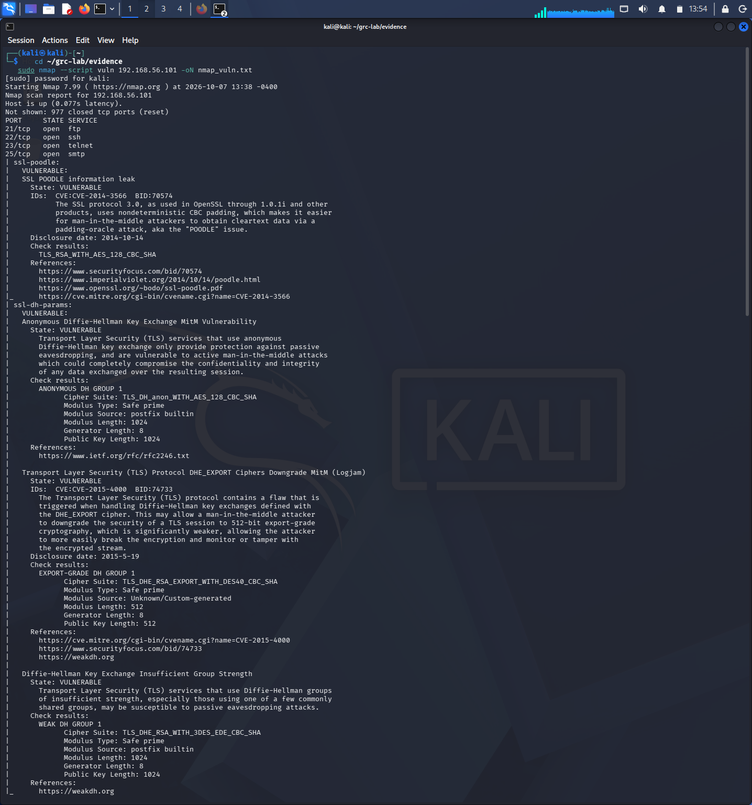
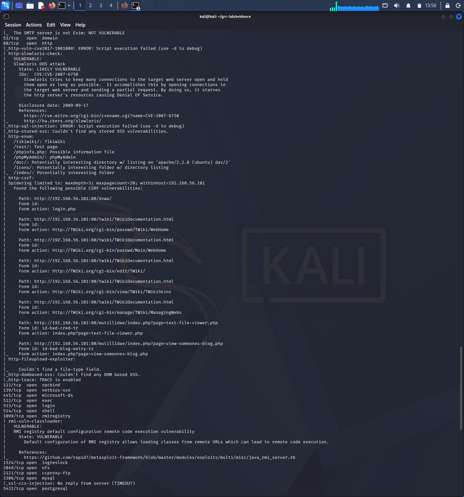
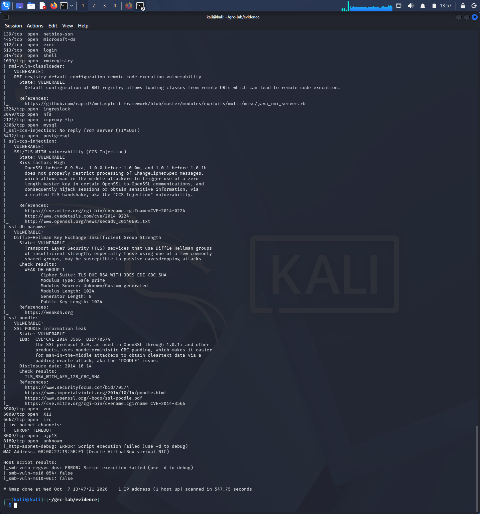

# Security Assessment — Metasploitable 2 Lab

A hands-on GRC-oriented security assessment of a deliberately vulnerable host in an isolated virtual lab. The project runs the full workflow a GRC analyst would: scope an assessment, gather evidence with real tools, translate raw findings into scored risks, map them to control frameworks, and communicate prioritised recommendations.

**Prepared by Kinan Alghamdi** · GitHub: [kinan213](https://github.com/kinan213)

---

## Summary

A single host (Metasploitable 2) was assessed inside an isolated VirtualBox lab. The assessment found **21 vulnerabilities — 11 Critical, 4 High, 5 Medium, 1 Low**. The host runs an end-of-life operating system and exposes a large surface of outdated, insecure services, several of which allow full, unauthenticated compromise.

The headline takeaway: the host should not touch any production or internet-facing network in its current state. The root cause is a systemic absence of patch management and secure configuration, not any single flaw — so the fix is to rebuild on a supported OS and disable unnecessary services.

---

## Lab Setup

Two virtual machines on a VirtualBox **host-only network**, fully isolated from the internet:

| Machine | Role | Lab IP |
| --- | --- | --- |
| Kali Linux | Assessor | 192.168.56.102 |
| Metasploitable 2 | Target | 192.168.56.101 |

Kali used two adapters — NAT for tool updates, host-only for the isolated lab. Isolation was verified by confirming the target could not reach the internet.

**Isolation proof** — the target cannot reach the internet (`ping 8.8.8.8` fails), confirming the lab is sealed:

**Connectivity** — the assessor can reach the target over the host-only network:

---

## Methodology

The assessment ran in three stages:

1. **Host discovery** — mapped the lab network and confined scanning to the single in-scope target.
2. **Service & version detection** — scanned all 65,535 TCP ports to enumerate open services, versions, and OS.
3. **Vulnerability detection** — ran Nmap's NSE vulnerability scripts to confirm specific CVEs.

Each finding was recorded in a risk register and scored using a **likelihood × impact** model (1–5 each), banded into Low / Medium / High / Critical, and mapped to both **ISO/IEC 27001** and the **NIST Cybersecurity Framework**.

**Host discovery + full service scan** — 23 open services and an end-of-life Linux 2.6 kernel:

---

## Key Findings

The most serious findings fall into five themes:

- **Backdoors & remote code execution** — bind shell on port 1524 (unauthenticated root), vsftpd 2.3.4 backdoor (CVE-2011-2523), UnrealIRCd backdoor (CVE-2010-2075), Java RMI RCE (port 1099).
- **Cleartext protocols** — Telnet, rlogin/rsh/rexec, and FTP all transmit credentials unencrypted.
- **Exposed network services** — MySQL, PostgreSQL, Samba, and NFS reachable over the network.
- **Outdated transport cryptography** — POODLE (CVE-2014-3566), Logjam (CVE-2015-4000), OpenSSL CCS Injection (CVE-2014-0224).
- **End-of-life OS** — Linux 2.6 kernel, no longer receiving security patches. This is the root cause tying the other findings together.

**Confirmed TLS vulnerabilities** (POODLE, Logjam):

**Java RMI remote code execution + exposed web admin pages**:

**CCS Injection, plus negative results recorded (SMB MS10-054 / MS10-061 not vulnerable)**:

---

## Risk Summary

| Risk Level | Count |
| --- | --- |
| Critical | 11 |
| High | 4 |
| Medium | 5 |
| Low | 1 |
| **Total** | **21** |

More than half of all findings are Critical. On a live system this would be an emergency — multiple independent paths to full host compromise. Combined with an unsupported OS, the host cannot be meaningfully secured through incremental fixes and should be rebuilt.

---

## Recommendations

**Do first — contain the critical exposure**
- Isolate the host until remediated; remove the bind-shell backdoor and rebuild from a trusted image; secure/replace the backdoored services.

**Do next — reduce the attack surface**
- Disable cleartext protocols (enforce SSH); restrict database and file-sharing services to trusted hosts; disable weak TLS and patch OpenSSL.

**Ongoing — address the root cause**
- Migrate to a supported OS with a patch-management process; define a secure-configuration baseline; remove diagnostic/admin web pages.

---

## Project Files

**Deliverables**
- [Risk_Register.xlsx](Risk_Register.xlsx) — all 21 findings, scored, banded, mapped to ISO 27001 / NIST, with CVE evidence.
- [Security_Assessment_Report.pdf](Security_Assessment_Report.pdf) — full written report with executive summary, methodology, findings, and recommendations.

**Raw evidence (scan output)**
- [discovery.txt](discovery.txt) — host discovery scan.
- [nmap_full.txt](nmap_full.txt) — full-port service and version scan.
- [nmap_vuln.txt](nmap_vuln.txt) — NSE vulnerability scan with CVEs.

---

## Note on Scope & Honesty

All testing was confined to the single in-scope host (192.168.56.101) on an isolated lab network; the gateway, DHCP service, and assessor host were explicitly out of scope and left untouched. The two software backdoors are rated on known-vulnerable version numbers rather than active re-exploitation, a distinction noted in the register. Likelihood and impact scores reflect this isolated lab context and would be revisited for a production deployment.
